# Conceptual diagram

```mermaid
---
config:
  layout: elk
---
classDiagram
direction TB
    class User {
        +id: String
        +name: String
        +email: String
        +image: String
        +createdAt: DateTime
    }

    class Profile {
        +id: String
        +username: String
        +bio: String
        +phone: String
        +locale: String
        +totalCo2Saved: Double
        +xpPoints: Integer
        +ridesAsDriver: Integer
        +ridesAsPassenger: Integer
        +badges: List~Badge~
        +/level: Integer
    }
    note for Profile "MAINTAINED on Ride.complete() in one tx:<br/>&nbsp;&nbsp;driver: totalCo2Saved += ride.actualCo2SavedKg,<br/>&nbsp;&nbsp;&nbsp;&nbsp;ridesAsDriver += 1, xpPoints += XP_DRIVER + 5 * floor(co2)<br/>&nbsp;&nbsp;each accepted passenger: totalCo2Saved += ride.actualCo2SavedKg,<br/>&nbsp;&nbsp;&nbsp;&nbsp;ridesAsPassenger += 1, xpPoints += XP_PASSENGER + 5 * floor(co2)<br/>&nbsp;&nbsp;badges = badges ++ computeNewBadges(after-state)<br/>RATIONALE: feel-good per-user metric;<br/>&nbsp;&nbsp;sharing the car earns credit for the<br/>&nbsp;&nbsp;whole carpool's avoided impact.<br/>CAVEAT: per-user totals over-count for<br/>&nbsp;&nbsp;org / system aggregations — sum rides<br/>&nbsp;&nbsp;directly there, not user totals.<br/>DERIVED: level = floor(sqrt(xpPoints / 100))"

    class Badge {
        +id: String
        +awardedAt: DateTime
    }
    note for Badge "Stored inline on Profile as JSONB array<br/>(no separate table).<br/>Catalogue of valid ids lives in<br/>users/domain/gamification.ts."

    class Organization {
        +id: String
        +name: String
        +domain: String
    }

    class Trip {
        <<abstract>>
        +id: String
        +status: TripStatus
        +seatsOffered: Integer
        +/estimatedCo2SavingsPerSeatKg: Double
        +totalDistanceKm: Double
        +estimatedDurationMinutes: Integer
        +routePolyline: String
        +conversationStyle: ConversationStyle
        +smokeAllowed: Boolean
        +musicAllowed: Boolean
        +musicGenre: MusicGenre
        +cancelledAt: DateTime
        +cancellationReason: String
        +archivedAt: DateTime
        +generateRides()
    }
    note for Trip "CONSTRAINT: seatsOffered <= car.passengerSeats<br/>CONSTRAINT: origin <> destination<br/>CONSTRAINT: totalDistanceKm > 0<br/>DERIVED: estimatedCo2SavingsPerSeatKg =<br/>&nbsp;&nbsp;totalDistanceKm * car.carModel.co2KgPerKm<br/>CASCADE: status = #CANCELLED implies<br/>&nbsp;&nbsp;rides->status = #CANCELLED and<br/>&nbsp;&nbsp;rides.bookings->select(status in {#PENDING, #ACCEPTED})<br/>&nbsp;&nbsp;.status = #REJECTED<br/>TRIGGER: generateRides()"

    class Ride {
        +id: String
        +scheduledDeparture: DateTime

        +originLabel: String
        +originLat: Double
        +originLng: Double
        +destinationLabel: String
        +destinationLat: Double
        +destinationLng: Double
        +totalDistanceKm: Double

        +status: RideStatus
        +seatsOffered: Integer
        +seatsOccupied: Integer
        +actualCo2SavedKg: Double
        +completedAt: DateTime
        +cancelledAt: DateTime
        +cancellationReason: String
    }
    note for Ride "CONSTRAINT: scheduledDeparture < now()<br/>&nbsp;&nbsp;implies isReadOnly<br/>CONSTRAINT: seatsOccupied <= seatsOffered<br/>SNAPSHOT: origin / destination / totalDistanceKm /<br/>&nbsp;&nbsp;seatsOffered / actualCo2SavedKg are frozen at ride<br/>&nbsp;&nbsp;generation (or last allowed Trip edit) and never<br/>&nbsp;&nbsp;recomputed after completion or cancellation<br/>CASCADE: trip.status = #CANCELLED<br/>&nbsp;&nbsp;implies status = #CANCELLED;<br/>&nbsp;&nbsp;status = #CANCELLED implies<br/>&nbsp;&nbsp;bookings->select(status in {#PENDING, #ACCEPTED})<br/>&nbsp;&nbsp;.status = #REJECTED"

    class CarModel {
        +id: String
        +brand: String
        +name: String
        +year: Integer
        +type: String
        +co2KgPerKm: Double
    }

    class Car {
        +id: String
        +plate: String
        +color: String
        +passengerSeats: Integer
    }

    class Booking {
        +id: String
        +status: BookingStatus
        +message: String
        +requestedAt: DateTime
        +acceptedAt: DateTime
        +rejectedAt: DateTime
        +cancelledAt: DateTime
    }
    note for Booking "CONSTRAINT: passenger <> ride.trip.driver<br/>CONSTRAINT: requestedAt < ride.scheduledDeparture<br/>DERIVED: batch = bookings->select(<br/>&nbsp;&nbsp;passenger = self.passenger and<br/>&nbsp;&nbsp;ride.trip = self.ride.trip)<br/>ATOMIC: batchAccept / batchReject operate<br/>&nbsp;&nbsp;on the whole batch"

    class TripChatThread {
        +id: String
        +createdAt: DateTime
    }
    note for TripChatThread "UNIQUENESS: one thread per (trip, passenger)<br/>PARTICIPANTS: trip.driver + passenger only<br/>LIFETIME: spans every ride generated by the trip<br/>NO participant table: membership is fixed and derivable"

    class ChatMessage {
        +id: String
        +body: String
        +createdAt: DateTime
        +deletedAt: DateTime
    }
    note for ChatMessage "OPTIONAL SCOPE: ride may be attached when a message<br/>&nbsp;&nbsp;is about a specific occurrence inside the trip<br/>CONSTRAINT: ride.trip = thread.trip when ride is present<br/>DELETE: soft delete only; ordering and audit history remain"

    class SporadicTrip {
        +departureAt: DateTime
    }
    note for SporadicTrip "CONSTRAINT: departureAt > now (at create)"

    class RecurringTrip {
        +startDate: Date
        +endDate: Date
        +daysOfWeek: Map~DayOfWeek, Boolean~
        +timeOfDay: Time
    }
    note for RecurringTrip "CONSTRAINT: endDate <= startDate + 365 days<br/>CONSTRAINT: startDate <= endDate<br/>CONSTRAINT: endDate >= today (Europe/Madrid) at create<br/>CONSTRAINT: at least one matching (date, timeOfDay) is in the future"

    class Location {
        +label: String
        +latitude: Double
        +longitude: Double
    }

    class ConversationStyle { <<enumeration>> QUIET, CASUAL, CHATTY }
    class MusicGenre { <<enumeration>> POP, ROCK, REGGAETON, INDIE, NONE }
    class TripStatus { <<enumeration>> ACTIVE, CANCELLED, ARCHIVED }
    class RideStatus { <<enumeration>> ACTIVE, IN_PROGRESS, CANCELLED, COMPLETED }
    class BookingStatus { <<enumeration>> PENDING, ACCEPTED, REJECTED, CANCELLED, EXPIRED }

    class TrustedContact {
        +name: String
        +email: String
    }
    note for TrustedContact "PRECONDITION: User must have a TrustedContact<br/>&nbsp;&nbsp;before booking a seat or publishing a trip.<br/>UPDATE: PUT /me/trusted-contact upserts;<br/>&nbsp;&nbsp;there is no delete or null-clear path.<br/>USE: notified by email when the User reports<br/>&nbsp;&nbsp;a safety incident (see SafetyIncident)."

    class SafetyIncident {
        +category: IncidentCategory
        +note: String
        +createdAt: DateTime
    }
    note for SafetyIncident "WHO REPORTS: the trip driver, or a Booking's<br/>&nbsp;&nbsp;passenger with boardedAt IS NOT NULL on the ride.<br/>WINDOW: the ride must be in_progress, or completed<br/>&nbsp;&nbsp;within the last 24h; otherwise<br/>&nbsp;&nbsp;400 INCIDENT_WINDOW_CLOSED.<br/>SIDE EFFECT: Ride.flaggedForReview = true (never<br/>&nbsp;&nbsp;unset); reporter's TrustedContact receives an<br/>&nbsp;&nbsp;email post-commit with the ride + the other-party<br/>&nbsp;&nbsp;block (passenger reporter → driver + car;<br/>&nbsp;&nbsp;driver reporter → list of accepted passengers).<br/>READ: GET /me/incidents only — no cross-user view."

    class IncidentCategory { <<enumeration>> HARASSMENT, UNSAFE_DRIVING, ACCIDENT, OTHER }

    class Rating {
        +id: String
        +score: Integer
        +comment: String
        +createdAt: DateTime
    }
    note for Rating "WHO RATES: driver ↔ boarded passenger only.<br/>&nbsp;&nbsp;Rater must be the trip driver, OR a Booking's<br/>&nbsp;&nbsp;passenger with boardedAt IS NOT NULL on that ride.<br/>&nbsp;&nbsp;Ratee is the counter-party (other direction).<br/>WINDOW: ride.status = #COMPLETED. No deadline.<br/>UNIQUENESS: one rating per (ride, rater, ratee).<br/>&nbsp;&nbsp;Duplicate submit → 409 RATING_ALREADY_SUBMITTED;<br/>&nbsp;&nbsp;ineligible pair → 400 RATING_NOT_ELIGIBLE.<br/>SCORE: integer 1–5 (DB CHECK + class-validator).<br/>COMMENT: optional, ≤ 500 chars, admin-visible only.<br/>IMMUTABILITY: no edit, no delete in v1.<br/>AGGREGATE: averageScore + count computed on read<br/>&nbsp;&nbsp;via (ratee_id, created_at desc) index; no<br/>&nbsp;&nbsp;denormalised counter on User."

    class Wallet {
        +balanceCents: Integer
        +heldCents: Integer
        +/availableCents: Integer
        +payoutStatus: PayoutStatus
    }
    note for Wallet "DERIVED: availableCents = balanceCents − heldCents.<br/>SOLE WRITER: WalletService — all balance and<br/>&nbsp;&nbsp;hold mutations flow through it.<br/>LAZY: getOrCreateWallet on first access."

    class WalletHold {
        +amountCents: Integer
        +status: WalletHoldStatus
    }
    note for WalletHold "RESERVES against Wallet.heldCents at booking<br/>&nbsp;&nbsp;accept; resolves on capture (boarding) or<br/>&nbsp;&nbsp;release (cancellation / refund override).<br/>CONSTRAINT: at most one ACTIVE hold per Booking<br/>&nbsp;&nbsp;(partial-unique index)."

    class WalletHoldStatus { <<enumeration>> ACTIVE, RELEASED, CAPTURED }

    User "1" --> "1" Profile : has
    User "1" --> "0..1" TrustedContact : trusts
    User "1" --> "0..*" SafetyIncident : reports
    Ride "1" --> "0..*" SafetyIncident : flagsOn
    User "1" --> "0..*" Rating : rates
    User "1" --> "0..*" Rating : ratedBy
    Ride "1" --> "0..*" Rating : context
    User "1" --> "0..1" Wallet : owns
    Wallet "1" --> "0..*" WalletHold : reserves
    Booking "1" --> "0..*" WalletHold : holdsFor
    Organization "0..1" --> "0..*" User : contains
    User "1" --> "0..*" Car : registers
    User "1" --> "0..*" Trip : drives
    User "0..*" --> "0..*" Trip : favorites

    User "1" --> "0..*" Booking : books
    Booking "0..*" --> "1" Ride : targets
    User "1" --> "0..*" TripChatThread : passenger
    User "1" --> "0..*" ChatMessage : sends
    Trip "1" --> "0..*" TripChatThread : hosts
    TripChatThread "1" --> "0..*" ChatMessage : contains
    Ride "0..1" --> "0..*" ChatMessage : scopes

    Trip "1" --> "1..*" Ride : generates

    Trip <|-- SporadicTrip
    Trip <|-- RecurringTrip

    Trip "0..*" --> "1" Car : uses
    Trip "1" --> "1" Location : origin
    Trip "1" --> "1" Location : destination

    Car "0..*" --> "1" CarModel : is a
```

## Design notes

- **Trip is the contract template; Ride is its frozen instance.** Origin, destination, distance, seats offered, and the final `actualCo2SavedKg` are snapshotted onto each Ride when it is generated. Once a Ride completes or is cancelled, its snapshot is never rewritten — historical truth is preserved even if the parent Trip is later edited.
- **Sensitive Trip edits are blocked while any future Ride has an active booking** (`PENDING` or `ACCEPTED`). When edits are allowed, the change propagates as a re-snapshot to all future `ACTIVE` rides; past or cancelled rides are untouched.
- **CO2 fields are server-computed; clients never do math.** `Trip.estimatedCo2SavingsPerSeatKg` is derived at read time from `totalDistanceKm * car.carModel.co2KgPerKm`. `Ride.actualCo2SavedKg` is computed at completion using the then-current car/model values and stored as the final frozen number.
- **`Profile.totalCo2Saved`, `xpPoints`, ride counters, and `badges` are all maintained as a single side effect of `Ride.complete()`.** When a Ride completes, a `RIDE_COMPLETED` domain event publishes the recipient list (driver + accepted passengers) and the value of `actualCo2SavedKg`. One subscriber opens a transaction that `SELECT ... FOR UPDATE`s the recipient rows, then for each row increments CO2 + XP + the role-specific ride counter and appends any newly-earned badges in the same `UPDATE`. Subscriber failures are isolated and logged - they must never propagate back to the request that completed the Ride; drift is logged for diagnosis instead.
- **XP and leveling are pure functions in `users/domain/gamification.ts`.** XP per ride = `XP_DRIVER_RIDE_COMPLETED (50)` or `XP_PASSENGER_RIDE_COMPLETED (30)` + `5 * floor(actualCo2SavedKg)`. Level = `floor(sqrt(xpPoints / 100))` — derived at read time, never stored. Badge triggers (`first_ride_driver`, `ride_milestone_10`, `co2_savior`, `eco_warrior`) are evaluated against the post-update state of the same profile row, so a single ride can grant multiple badges atomically.
- **Two surfaces read these fields.** `GET /me/sustainability` exposes derived metrics (`equivalentTreesPerYear`, `equivalentFuelLitresSaved`) computed from `totalCo2Saved`; `GET /api/leaderboard` ranks profiles by `xpPoints` or `totalCo2Saved`. The leaderboard never reads `badges` — keeping that column out of the cross-user query path is why badges live inline on the row.
- **Two CO2 metrics coexist; neither overwrites the other.** The **truth** - actual emissions avoided by the platform - is always derivable as the sum of `Ride.actualCo2SavedKg` over completed rides (scoped however needed: system-wide, per-org, per-time-window). The **per-user feel-good number** - `Profile.totalCo2Saved` - is maintained by crediting every participant the full ride amount; it intentionally over-counts at the user level so every participant feels they contributed to the avoided impact. **Rule of thumb**: use `Profile.totalCo2Saved` only for "how am I doing?" UI. For "how is the platform / org doing?" or any total that should match real-world avoided emissions, aggregate from `Ride.actualCo2SavedKg` directly.
- **Trip chat is passenger-specific and trip-scoped.** Each passenger gets one thread per Trip, not per Ride. A recurring Trip therefore keeps one continuous driver <-> passenger conversation across all of its generated rides.
- **Thread membership is derived, not stored twice.** The two participants are always the Trip's driver and the thread's passenger, so a separate participant join table would duplicate existing truth.
- **Messages may reference a specific Ride without changing the thread boundary.** A message can optionally point at one Ride when it is about that occurrence, but the Ride must belong to the same Trip as the parent thread.
- **Message deletion is soft-delete only.** Deleted messages remain in chronological history as tombstones so ordering, unread calculations, and auditability do not break.
- **Cars and car models are soft-deleted reference data.** Editing plate, color, model, or seat count never rewrites ride history - Rides hold the values they need, and the FK chain survives a soft delete.
- **Car deletion is blocked while any of its trips is `ACTIVE`.** Driver must cancel those trips first. `ARCHIVED` / `CANCELLED` trips referencing the car do not block deletion (the car is no longer in use).
- **Trip auto-archives (`status` → `ARCHIVED`) when its lifecycle ends.** Trigger-driven on ride state changes: when no future `ACTIVE` rides remain AND the schedule is done (sporadic with terminal ride; recurring with `endDate < now`). No driver action — the system observes. `CANCELLED` and `ARCHIVED` are both terminal; `CANCELLED` does not transition further.
- **`PENDING` bookings auto-expire to `EXPIRED` via a periodic sweep.** When a ride's `scheduledDeparture` passes, any still-`PENDING` bookings on it are transitioned. Single sweep, no per-endpoint logic. Accept/reject operations additionally refuse to act on bookings whose ride has already departed, so the sweep's lag never produces an inconsistent action.
- **TrustedContact is a hard precondition for booking and publishing.** Every booking-create and trip-publish request runs `TrustedContactService.assertHasContact` inside the same transaction as the action it gates; missing → `TRUSTED_CONTACT_REQUIRED` (403). The upsert path never clears, so the gate is stateless from the FE's perspective: once set, every subsequent action passes.
- **Wallet is the single ledger for in-app payment.** `WalletService` is the sole writer of `balanceCents`, `heldCents`, `wallet_transactions`, and `wallet_holds` — every primitive locks the affected wallet row `FOR UPDATE` and accepts a `tx`. Holds (`WalletHold`) reserve funds at booking accept and resolve to either `captured` (boarding scan, no-show capture at completion) or `released` (cancellation, refund override). A captured hold writes the `payment`/`earning` ledger pair; a released hold does not.
- **Booking resolution is funnelled through a single seam.** `BookingsService.markBookingResolved(tx, bookingId, finalStatus)` is the only path through which an `accepted` (or `pending`) booking moves to `cancelled` / `rejected` / `expired`. The seam flips the booking row and calls `WalletService.releaseHold` in the same transaction. Cascades (ride / trip cancel, reject-all), passenger cancellations, driver rejections, and the booking-expiry sweep all funnel through it; future resolution paths get hold release for free.
- **Boarding token is stateless.** `GET /me/bookings/:id/boarding-token` returns an HMAC-signed `{ bookingId, window }` token that rotates every ~30 seconds (one slot of skew accepted). `POST /boarding-scans` verifies the token, captures the hold via `WalletService.captureHold`, and stamps `bookings.boarded_at`. Replay across boardings is blocked by `boarded_at IS NOT NULL`. The path is flat — the token pins both the booking and the ride.
- **SafetyIncident is append-only and side-effects the parent ride.** Eligibility is the trip driver, or a Booking's passenger with `boardedAt IS NOT NULL` on that ride; the reporting window is `ride.in_progress` or completed ≤ 24 h ago. Inserting the row also sets `Ride.flaggedForReview = true` in the same transaction, and the reporter's TrustedContact receives an email post-commit. The email failure path is isolated — a bad send never rolls back the row the reporter already submitted.
- **Rating is append-only and aggregated on read.** Direction is driver ↔ boarded passenger only (no passenger-to-passenger, no anonymous, no self-rating). Eligibility resolves in order — ride completed → rater participated → ratee is the counter-party → no prior `(ride, rater, ratee)` row — and the unique index is the final backstop against parallel-submit duplicates (`23505` → `RATING_ALREADY_SUBMITTED`). Profile-facing reads return `{ averageScore, count }`; `averageScore` is `null` when `count === 0` so the FE doesn't special-case "no ratings yet". Comments are admin-visible only — `GET /me|users/:id/ratings/summary` never exposes them. No edit, delete, or notification side-effect in v1.
- **Three crons run inside the API process** (see `state-machines.md` for the per-entity transitions): the booking-expiry sweep flips stale pending bookings; the traffic watcher fans out delay pushes; the rides-sweep handles idle-in-progress completion, stranded-active cancellation (`driver_no_show`), and an orphan-hold backstop that releases active holds against terminal bookings and logs `logger.error` — a hit indicates a missed cancellation seam upstream, not a routine cleanup.
- **State machine diagrams** for Trip, Ride, and Booking live in `state-machines.md`.
