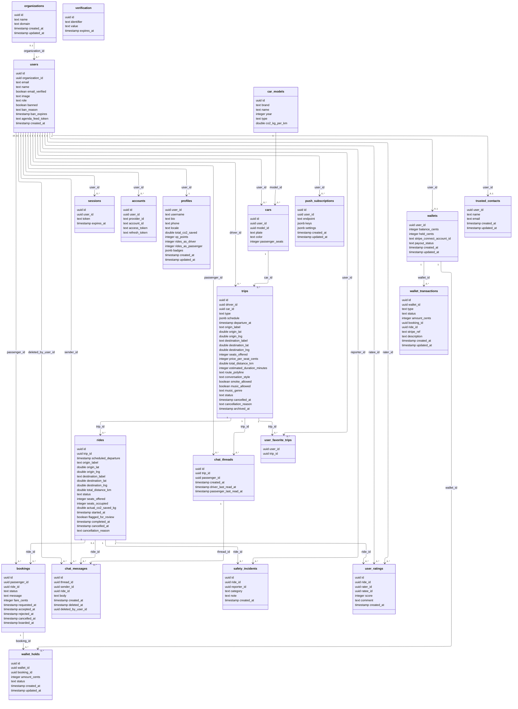

# DB diagram

## Notes

- **Trip uses single-table inheritance.** `type` discriminates between `sporadic` and `recurring`. `departure_at` is non-null for sporadic only; `schedule jsonb` carries `{ startDate, endDate, daysOfWeek, timeOfDay }` for recurring only.
- **Recurring trips pre-generate the full ride horizon at trip creation.** Allowed edits to a recurring trip (no active bookings on any future ride) re-generate future `ACTIVE` rides; completed and cancelled rides are untouched.
- **Soft-delete `cars` and `car_models`.** Historical rides keep referencing them via the existing FK chain; hard deletion would orphan ride history.
- **`profiles.user_id` is the PK** (no separate surrogate id). The 1:1 relationship to `users` is enforced by `user_id` being PK + FK.
- **`organizations.domain` has a unique index** (`organizations_domain_idx`). Domain is normalised to lowercase before insert.
- **`profiles.total_co2_saved`, `xp_points`, `rides_as_driver`, `rides_as_passenger`, and `badges` are all maintained by a single side effect of Ride completion.** A `RIDE_COMPLETED` domain event fires after a Ride completes; `ProfileRideCompletedSubscriberService` opens one transaction that `SELECT ... FOR UPDATE`s the recipient profile rows and atomically increments CO2, XP, the role-specific ride counter, and appends any newly-earned badge ids to the `badges` jsonb array. Subscriber failures are isolated and logged - they do not propagate to the ride-completion response. See `conceptual-diagram.md` design notes for CO2 attribution rules and the XP/leveling formula.
- **`profiles.badges` is a JSONB array of `{ id, awardedAt }`.** No separate badges table because the list is small, user-specific, and never queried cross-user. The catalogue of valid `id`s lives in `users/domain/gamification.ts`.
- **`bookings.status` values:** `PENDING`, `ACCEPTED`, `REJECTED`, `CANCELLED`, `EXPIRED`. The `EXPIRED` value is set by a periodic sweep when a `PENDING` booking's ride departs without driver action.
- **`chat_threads` is one row per `(trip_id, passenger_id)`.** The driver is derived from `trips.driver_id`; there is no `chat_participants` join table in v1 because membership is fixed at exactly two users.
- **`chat_threads.driver_last_read_at` / `passenger_last_read_at` are per-role read cursors.** `POST /chat-threads/:id/read` sets the cursor for the calling role. Unread counts in `GET /me/chat-inbox` are computed as messages from the other participant with `created_at > <my_cursor>`; a null cursor means every non-deleted message from the other participant is unread.
- **`chat_messages.ride_id` is nullable.** When present, it scopes the message to one ride inside the thread's trip; application logic must reject a `ride_id` that belongs to another trip.
- **Message deletion is soft-delete.** `deleted_at` and `deleted_by_user_id` hide the body while preserving the row for chronological order and audit history.
- **Chat writes are blocked at the application layer** once the parent trip is no longer `ACTIVE`, but participants may still read the thread history afterward.
- **Trip auto-archive** is event-driven on ride state changes (no database scheduler needed). When a ride hits a terminal state, the parent trip is checked and may transition to `ARCHIVED`.
- **Car deletion is blocked at the application layer** if any trip in `status=ACTIVE` references it. There is no database-level cascade; the constraint is enforced explicitly so the driver receives a clear `409` and is prompted to cancel trips first.
- **`push_subscriptions` is per-device, not per-user.** `endpoint` is uniquely indexed; the same user may have several rows (phone, tablet, browser). `settings` is a jsonb blob of per-device toggles (currently `{ traffic_alerts: boolean }`). Rows are upserted by endpoint on registration and cascade-deleted with the user.
- **`user.agenda_feed_token` is null until first ICS-feed request.** The token is minted lazily by `GET /me/agenda/feed`, rotatable via `POST /me/agenda/feed/rotate`, and authenticates the anonymous `GET /me/agenda.ics?token=…` endpoint that calendar apps poll. Lives on `user` (system-set identity) for the same reason `organization_id` does.
- **`wallets.user_id` is the PK** (no separate surrogate id). The 1:1 relationship with `user` is enforced by `user_id` being PK + FK; `WalletService.getOrCreateWallet` lazy-creates the row on first access. `balance_cents` is the total credit including any holds; `held_cents` is reserved against active bookings. Available balance = `balance_cents - held_cents`, denormalised the same way `rides.seats_occupied` is. `held_cents` is always 0 until Phase 5 (boarding & holds) introduces `wallet_holds`. `stripe_connect_account_id` and `payout_status` (`none`/`pending`/`active`/`restricted`) track Connect Express onboarding state.
- **`wallet_transactions` is an append-only ledger of realized money movements.** `type` is one of `topup`/`withdrawal`/`payment`/`earning` (the last two land in Phase 5 when captures fire); `status` walks `pending → completed` or `pending → failed` via guarded updates. `amount_cents` is signed (positive = credit, negative = debit). The partial-unique index on `stripe_ref` (where not null) is the webhook idempotency key — duplicate Stripe deliveries are no-ops. `WalletService` is the sole writer of both this table and `wallets.balance_cents`/`held_cents`.
- **`wallet_holds` records the active reservations against `wallets.held_cents`.** Holds are not realized money — `wallet_transactions` rows fire only when a hold is `captured`. `status` walks `active → released` (passenger or cascade cancellation, refund override at completion) or `active → captured` (boarding scan, no-show capture at completion); the partial-unique index on `(booking_id) WHERE status = 'active'` guarantees at most one open hold per booking. Both terminal states (`released`, `captured`) are unbounded — a booking can accumulate multiple terminal rows across its history but never two active ones. Hold primitives (`placeHold`/`releaseHold`/`captureHold`) become live in Phase 5; the table is created earlier so the schema is stable.
- **`trips.price_per_seat_cents` is the driver-set per-seat fare in EUR cents.** Non-null, default 0; existing rows back-fill to 0 at migration time. Drivers choose the value at trip creation (no platform fee in v1). On accept, the value is frozen onto each booking as `bookings.fare_cents` and never changes thereafter — later trip-price edits do not retro-affect already-accepted bookings.
- **`bookings.boarded_at` is the authoritative boarding signal**, not `bookings.status`. Code reading "did this passenger board?" checks `boarded_at IS NOT NULL`. A no-show vs. normal boarding can be derived from `(boarded_at, ride.status)` without a dedicated booking-status value. Set by the boarding-scan endpoint (Phase 5) and by the post-completion "boarded anyway" override.
- **`rides.started_at` flips when the driver hits `POST /rides/:rideId/start`** (Phase 4). It serves two purposes: distinguishing `active` rides the driver has formally taken (`in_progress`) from those still pre-departure, and feeding the rides-sweep cron's "idle in-progress" query (`started_at < now() - interval '6 hours'`).
- **`rides.flagged_for_review` is set by `POST /rides/:rideId/incidents`** (Phase 6). Defaults to false; never unset. The flag is the only durable side effect of an incident report aside from the `safety_incidents` row itself — there is no admin review UI in v1; the flag exists so a future operator dashboard can surface flagged rides without scanning the incidents table.
- **`trusted_contacts.user_id` is the PK.** One trusted contact per user. The row is a precondition for booking a seat and publishing a trip (`TrustedContactService.assertHasContact` throws `TRUSTED_CONTACT_REQUIRED` (403) when missing); enforced on every request to keep the gate stateless. `PUT /me/trusted-contact` upserts and overwrites — there is no delete or null-clear path, by design.
- **`safety_incidents` is append-only.** One row per submitted report (US-06). Reads are limited to "incidents I reported" (`GET /me/incidents`) and the email-assembly join inside the safety module; there is no cross-user read path. Indexed `(reporter_id, created_at desc)` to serve the personal list view directly. Eligibility (boarded passenger or trip driver) and the 24-hour reporting window are enforced in the service.
- **`user_ratings` is append-only and immutable in v1 (US-07/08/09).** One row per `(ride_id, rater_id, ratee_id)` — enforced by a unique index that's also the duplicate-submit backstop (`23505` → `RATING_ALREADY_SUBMITTED`). Direction is driver ↔ boarded passenger only; the service rejects any other rater/ratee pair with `RATING_NOT_ELIGIBLE`. `score` is an integer 1–5 (also enforced by a DB `CHECK` constraint). Indexed `(ratee_id, created_at desc)` to back both the profile-summary aggregate (`GET /me|users/:id/ratings/summary`) and the admin paginated list (`GET /admin/users/:id/ratings`); no denormalised counter on `user`. No edit or delete endpoint in v1.
