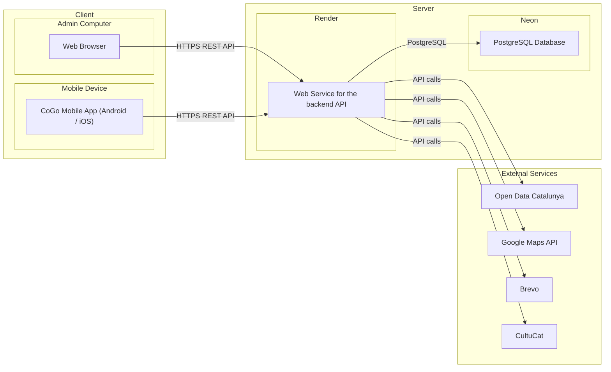

# Physical diagram

Deployment topology — where each component runs and which network hops cross trust boundaries.

## Notes

- **Backend** runs as a single Render Web Service, auto-deployed from `main`. There is no separate worker or scheduler process — periodic sweeps (booking expiry, trip auto-archive checks) and the WebSocket gateway (`/chat` namespace) live in the same Node process.
- **Database** is Neon Postgres. The connection string is set in the Render dashboard as `DATABASE_URL`; Drizzle migrations run manually from a developer machine, not in the deploy hook.
- **Outbound integrations** are all server-side; clients never talk to Brevo, Google Maps, Open Data Catalunya, or CultuCat directly. API keys live in Render env vars.
- **Push notifications** travel client → backend → (Web Push) → device push service → device. The arrow back to the mobile app isn't drawn because it doesn't go through the backend — devices register their push subscription via the REST API and then the push service delivers asynchronously.
- **Admin browser** uses the same REST API as the mobile app; there is no separate admin backend.
