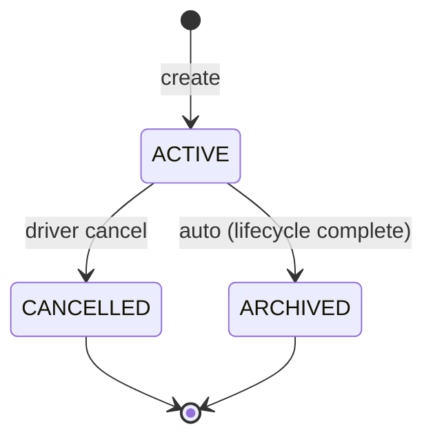
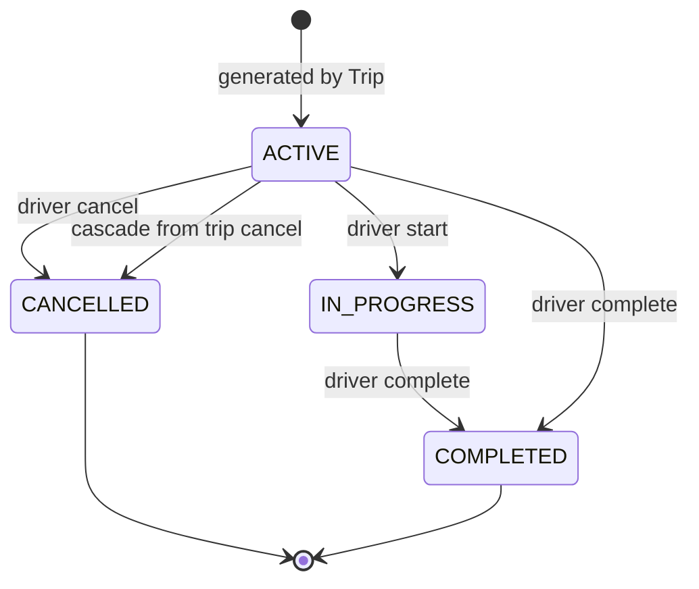
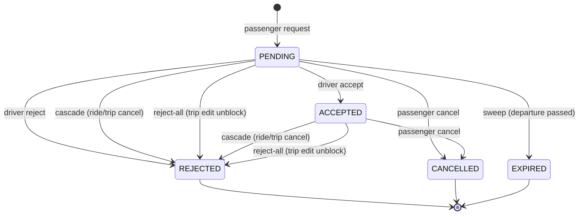

# State machines

Lifecycle diagrams for the three core entities. Each transition is annotated with what triggers it: an API action, a cascade from a parent entity, or a system event (a periodic sweep or a domain event handler).

## Trip



- **ACTIVE → CANCELLED** — driver action. Cascades all future rides to `CANCELLED` and their non-terminal bookings (`PENDING` + `ACCEPTED`) to `REJECTED`.
- **ACTIVE → ARCHIVED** — auto-trigger on ride state changes. Fires when the trip has no remaining `ACTIVE` rides AND its schedule is done (sporadic: the only ride is terminal; recurring: `endDate < now`). The trip has run its course.

  ```
  on ride state change (status → COMPLETED | CANCELLED):
    trip = ride.trip
    if trip.status != ACTIVE: return
    if exists r in trip.rides where r.status = ACTIVE: return
    if trip.type = sporadic:
      trip.status ← ARCHIVED                  // the only ride is terminal
    else if trip.type = recurring and trip.schedule.endDate < now():
      trip.status ← ARCHIVED                  // window closed, no future rides
    trip.archivedAt ← now()
  ```

- `CANCELLED` and `ARCHIVED` are both terminal. They are distinct on purpose: `CANCELLED` means the driver pulled the plug; `ARCHIVED` means the trip ran its course. `CANCELLED` does not transition further.

## Ride



- **ACTIVE → CANCELLED** — either explicit driver action on the single ride, or cascade from trip cancellation. Both cascade further to the ride's non-terminal bookings → `REJECTED`. The cancel cascade now funnels each booking through `BookingsService.markBookingResolved`, which releases the wallet hold in the same transaction.
- **ACTIVE → CANCELLED (cron)** — `RidesSweepService` cancels stranded active rides (`status='active' AND scheduled_departure < now() - interval '6 hours' AND started_at IS NULL`) via `RidesService.expireUnstarted`. Recorded with `cancellation_reason = 'driver_no_show'`. The cascade funnels each `accepted` booking through `markBookingResolved` as `rejected` (releases the hold) and each `pending` booking as `expired`; the parent trip auto-archives when no future active rides remain. Driver and every affected passenger get a push notification post-commit.
- **ACTIVE → IN_PROGRESS** — driver action via `POST /rides/:id/start` within a `−30 min … +2 h` window around `scheduled_departure`. Sets `started_at`. Outside the window → `400 RIDE_NOT_DEPARTED`. Already started or terminal → `400 RIDE_ALREADY_STARTED`.
- **IN_PROGRESS → COMPLETED** / **ACTIVE → COMPLETED** — explicit driver action via `POST /rides/:id/complete`. Per-passenger settlement: scanned bookings (`boardedAt` set) are already captured; unscanned bookings either honour `unscannedOutcomes[].outcome` (`boarded` = capture + stamp `boardedAt`; `refund` = release) or fall back to the default (`now >= scheduled_departure` → capture no-show with `boardedAt` left null; `now < scheduled_departure` → release as refund). Then freezes `actualCo2SavedKg = seatsOccupied * totalDistanceKm * carModel.co2KgPerKm`, where `seatsOccupied` is the post-loop count of bookings with `boardedAt IS NOT NULL`. ACTIVE → COMPLETED still requires the ride to have departed (`RIDE_NOT_DEPARTED` otherwise); from IN_PROGRESS the guard relaxes because the driver has already demonstrated departure by starting.
- **IN_PROGRESS → COMPLETED (cron)** — `RidesSweepService` auto-completes idle in-progress rides (`status='in_progress' AND started_at < now() - interval '6 hours'`) via `RidesService.settleAndComplete(tx, id, [])`. Same settlement loop as the manual complete path with no `unscannedOutcomes`. The driver gets a localised summary push (`N charged, M refunded`) post-commit.
- **Cancellation guards:** `RidesService.cancel` rejects with `RIDE_ALREADY_STARTED` once the ride is IN_PROGRESS (or terminal); passenger-side `cancelOne` / `cancelMineOnTrip` refuse with the same code once the ride is IN_PROGRESS or COMPLETED. Capture has happened (or is about to), so cancellation would leave the ledger inconsistent.
- **Side-effect:** after the transition commits, a `Ride.completed` domain event is published. Subscribers (e.g. the profile `totalCo2Saved` increment) react independently. Subscriber errors must be isolated — a failing subscriber must not fail the request that completed the ride.

## Booking



- **Driver actions:** `accept`, `reject`, and `reject-all` (trip-level). The first two operate on a single booking or a subset of a batch; `reject-all` targets every non-terminal booking on the trip and exists to unblock a sensitive Trip edit.
- **Passenger actions:** `cancel` (single booking, or all-in-batch via `POST /me/bookings/cancel` with `{ tripId }`).
- **Cascades:** when a ride or trip is cancelled, all non-terminal bookings (`PENDING` + `ACCEPTED`) on the affected rides → `REJECTED`. The cause can be inferred at read time from the parent ride/trip status (driver cancellation vs. explicit per-booking rejection).
- **Periodic sweep:** still-`PENDING` bookings on past rides → `EXPIRED` via `BookingsExpiryService`. The rides-sweep cron's stranded-active branch additionally funnels `PENDING` bookings on cancelled-by-no-show rides through the seam as `EXPIRED` and `ACCEPTED` bookings as `REJECTED`. Both sweeps go through `markBookingResolved`, so the wallet hold (if any) releases in the same transaction. Accept/reject operations additionally refuse to act on bookings whose ride has departed, so the sweep's lag never produces an inconsistent action.
- **Terminal states:** `REJECTED`, `CANCELLED`, `EXPIRED`. `ACCEPTED` is the stable confirmed state but not terminal — it can still transition to `CANCELLED` (passenger) or `REJECTED` (cascade or reject-all).
- **Resolution seam:** every transition from a non-terminal state to `CANCELLED` / `REJECTED` / `EXPIRED` goes through `BookingsService.markBookingResolved(tx, bookingId, finalStatus)`. The seam flips the booking and calls `WalletService.releaseHold` in the same transaction (no-op when no active hold exists, so PENDING bookings funnel safely). Direct repository writes that would skip the seam are not allowed.
- **Boarding signal:** `boarded_at` is the authoritative "did this passenger board?" column; `bookings.status` does NOT change at boarding. Read paths checking participation should test `boarded_at IS NOT NULL`.
